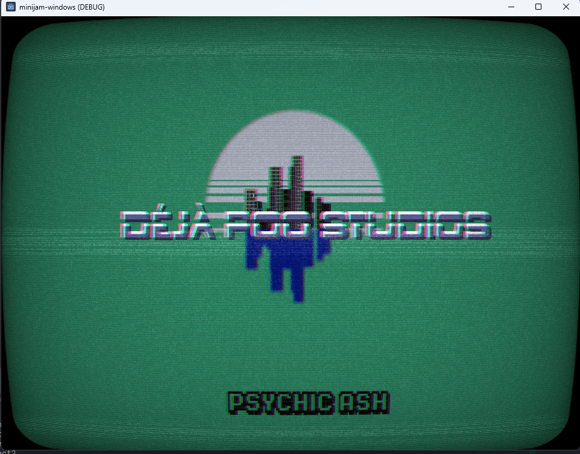
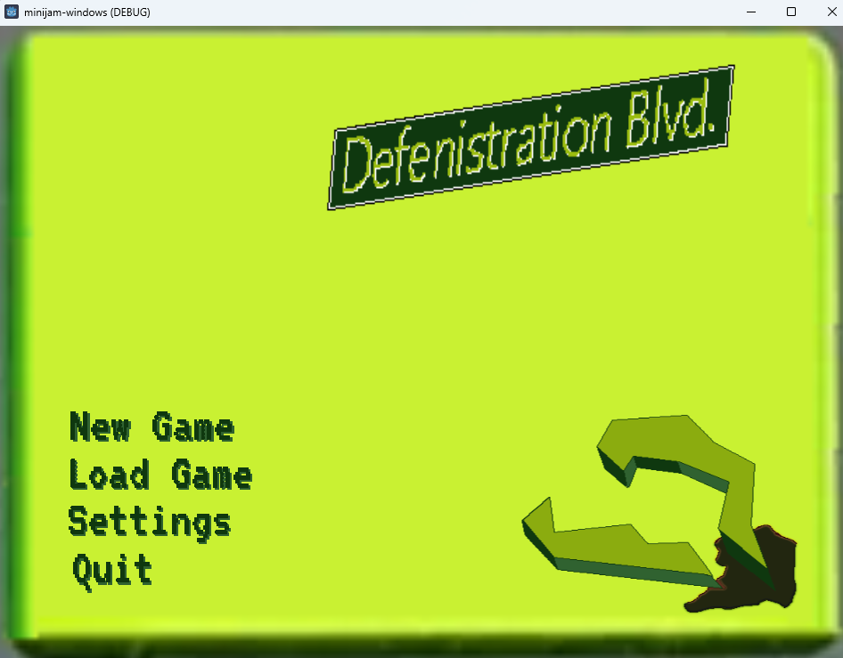
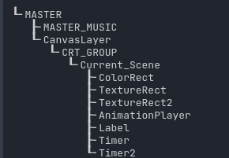
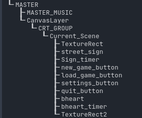
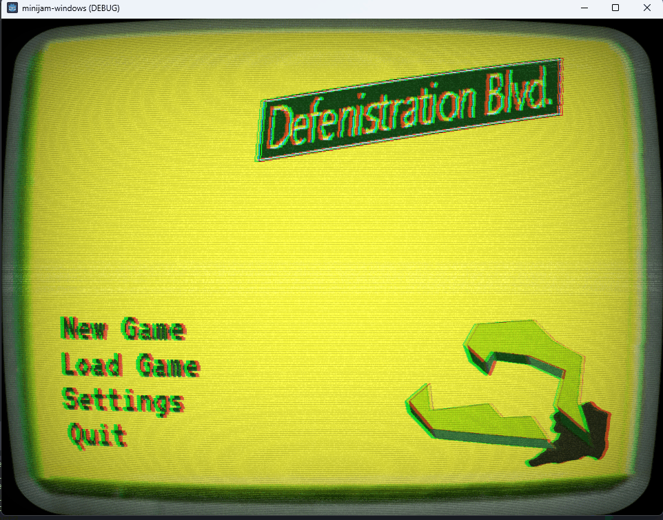

Problem:

Using a master controling file to swap scenes, the crt shader I was using was applying to the titlecard but not the main menu. These are two different scenes.

Master Scene has a script for controlling the scene changes. While I realize this is likely not the best way to handle this, it is what I'm currently using to figure out the system.

The master scene loads the first scene and handles exchanging scenes rather than using the change scene function.

The master controller code works by taking a scene name and a preloaded packed scene. It preloads the first scene after and then instances it. When it instances that scene, that scene preloads any scene it can directly move to and the process repeats once it moves to a new scene. 

Things like the options screen or in game menus will be part of the controller as they will need to be constantly loaded.

The pros of this setup are that it keeps all needed assets in memory but unloads them when they are more than one step away from the current scene.
I chose to remove child after queue_free as soemtimes, queue_free doesn't always release from memory right away and I don't want something to break later trying to reference a node that is or isn't still in memory. So I remove the reference.

The crux of this topic though is shaders which I'm new to. The crt shader works great for now (version 4). 

## [shaders file](crt.gdshader)

I ran into an issue where the shader was applied to the first scene but the scene it changed to wouldn't apply it.

First scene loaded in. 

Second Scene loaded in.

Before I explain what happened, I want to point out a detail in one of the trouble shooting steps I took. 

I tried printing out scene trees to make sure things were added correctly.

This did exactly what I assumed. However, it didn't include the information I needed.

The problem was that the second scene had a root node of "Node" instead of "Node2D". Shaders can't be applied to "Node". While this seems obvious, it's an example of one of those little details that can completely derail your day. 
For those that didn't know this, that information is also useful.

